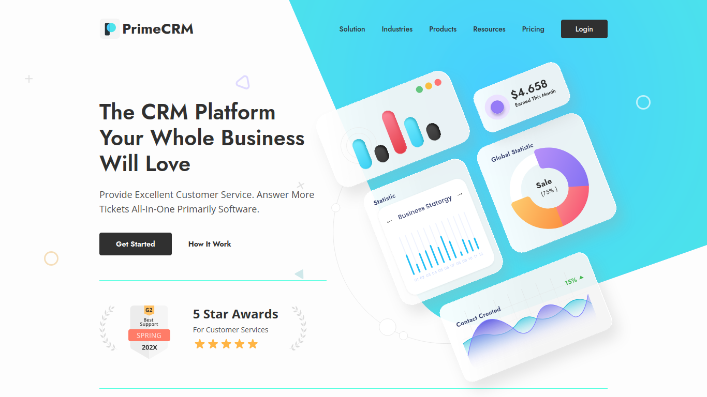

# PrimeCRM



This project was a frontend competition during a hackathon known as "Weekly December" organized by [GDG on Campus ISPM](https://gdg.community.dev/gdg-on-campus-institut-superieur-polytechnique-de-madagascar-antananarivo-madagascar/) on December 2023.

## Table of contents
- [Introduction](#introduction)
- [Rules of the hackaton](#rules)
- [Installation](#installation)

## Introduction
The purpose was to build the user interface of a landing page mockup in less than 48 hours. Here is the mockup link: https://bit.ly/3uDqu2h. And here is the outcome of this repository: https://nick-kevin.github.io/WEEKLY_DECEMBER_FRONT_1/.

I've committed some changes lately because our work was not 100% done for the deadline due to power issue, but as the winner of frontend category of this hackathon, I'm thrilled to clue you in that it's completely done.

## Rules
Here are the rules during the competition:
#### Fidelity to the Mockup (20 points)
Deduct 1 point for each notable inconsistency with the mockup.
#### Compliance with W3C Standards (20 points)
The jury used validator.w3.org and compute an average score.
#### Responsiveness (20 points)
. The provided mockups are not responsive, so it is up to the participants to create a responsive preview.  
. Deduct 1 point for each notable flaw or inconsistency (e.g., spacing issues, horizontal scrolling, navbar problems, click issues, etc.).
#### Compatibility (20 points)
. The jury tested our outcomes on Google Chrome, Brave, Firefox, and Microsoft Edge.
. For each browser where it does not function properly, deduct 5 points.
#### Performance (20 points)
Performance was measured using “Lighthouse” on Google Chrome, and points were be awarded based on the results of this performance test.
#### Bonus Points
Bonus points were awarded for the lightest projects and for the animations.

## Installation
1. Clone the repository:
```bash
   git clone https://github.com/Nick-Kevin/WEEKLY_DECEMBER_FRONT_1.git
```

2. Open the index.html file in the WEEKLY_DECEMBER_FRONT_1 folder on your favorite browser. Just make sure that you have a network connection.